

  <a href="../../releases/latest">
    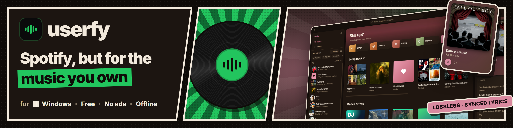
  </a>

# userfy

  userfy is Spotify for the music you already own. Point it at your folders and get home shelves, daily mixes, synced lyrics, radio and Wrapped, with no ads, no account and nothing phoning home. 
  Runs on Windows 10 and 11.

## Screenshots

  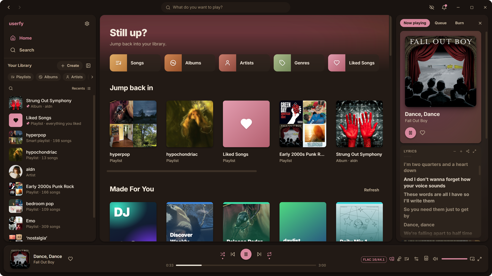

userfy comes with dark and light themes and four accent colours:

  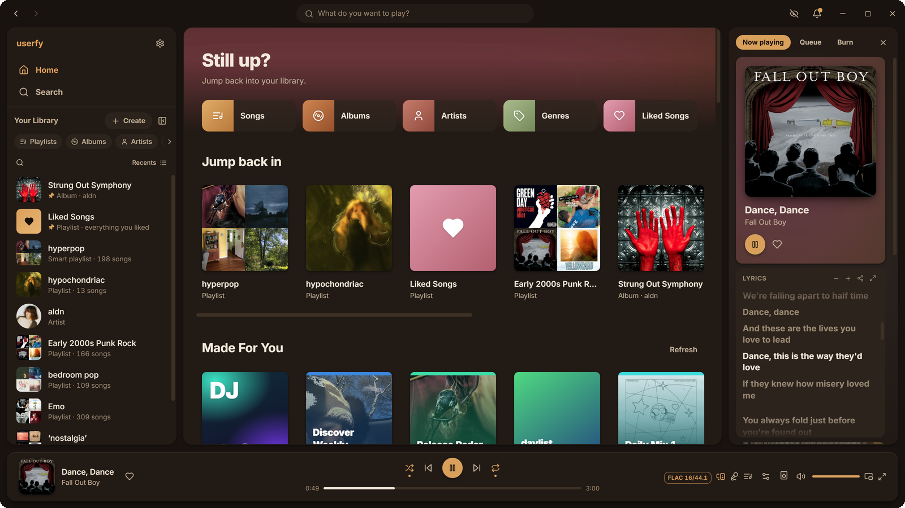
  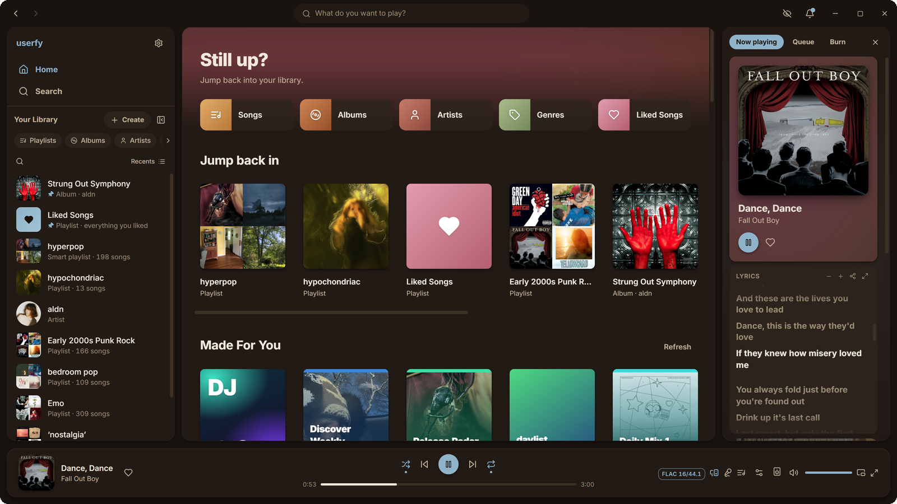
  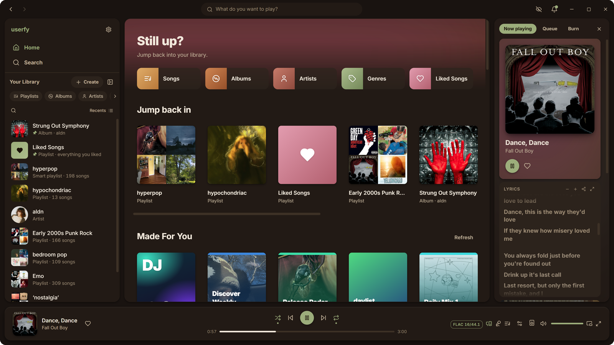

  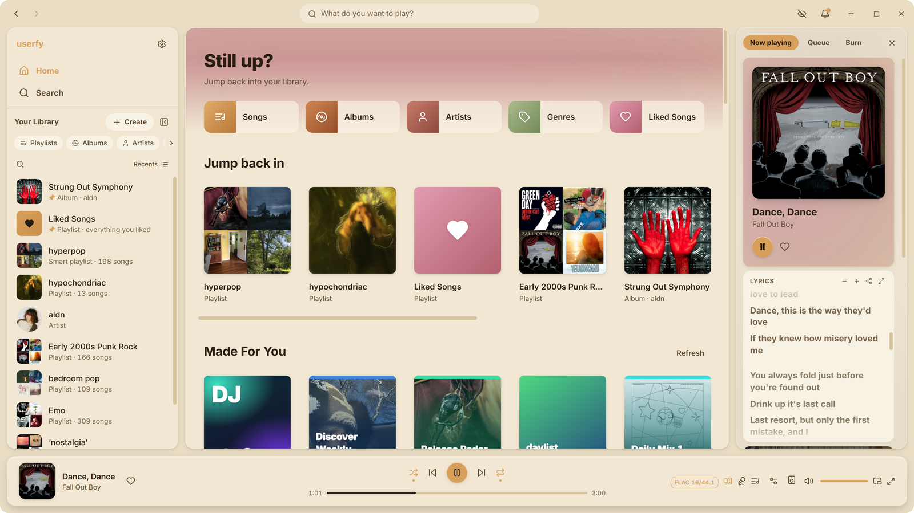
  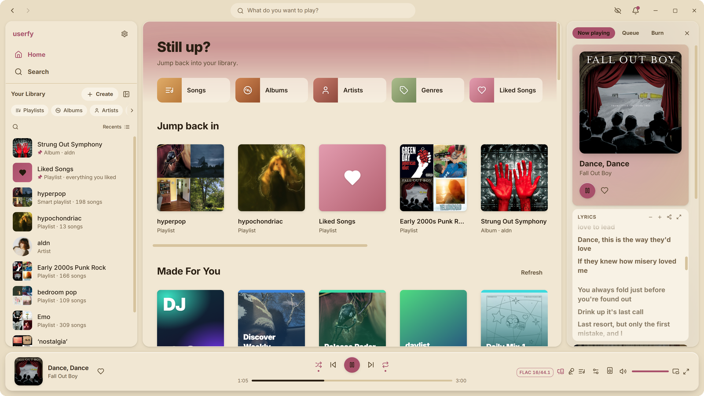
  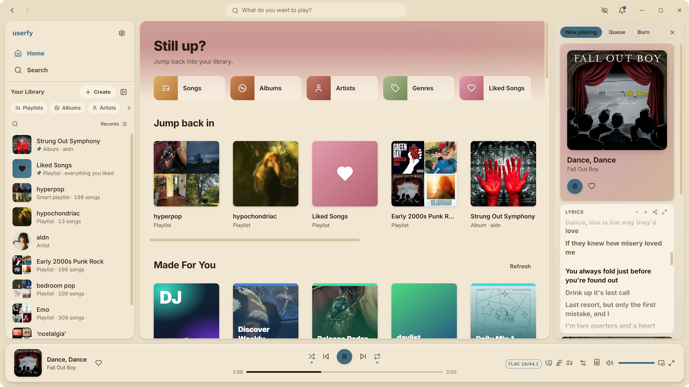

| | |
|:---:|:---:|
|  | 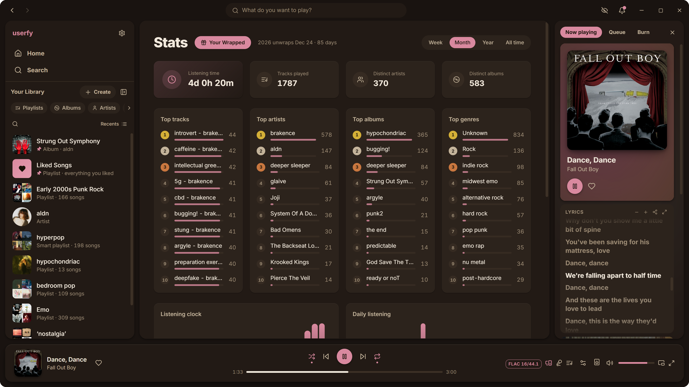 |
| Made For You and your top mixes | Listening stats |
| 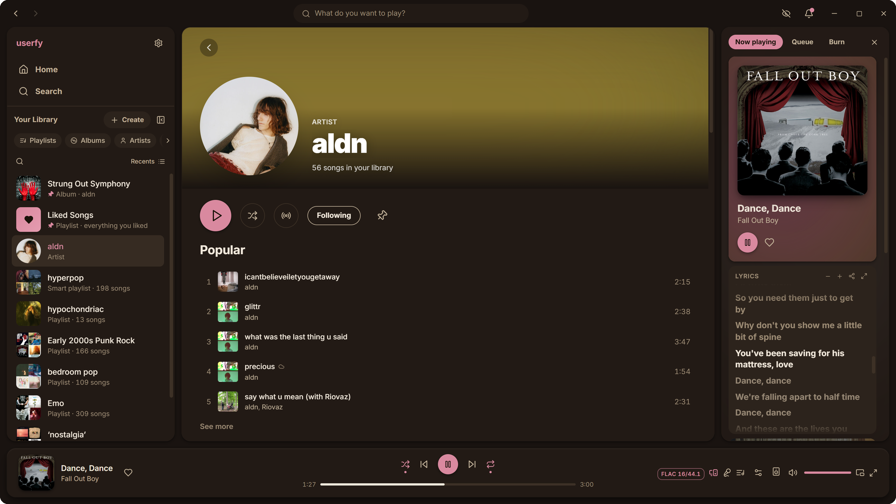 | 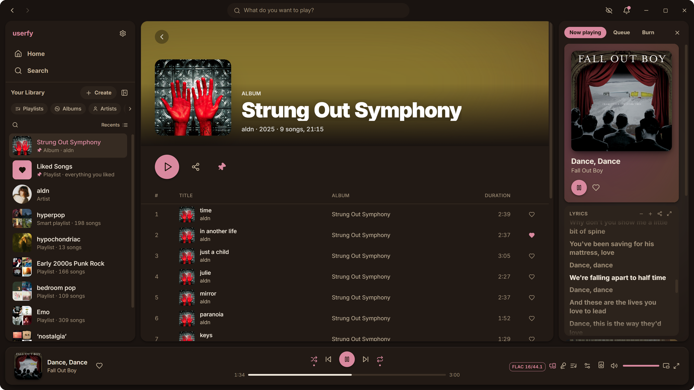 |
| Artist page | Album page |
| 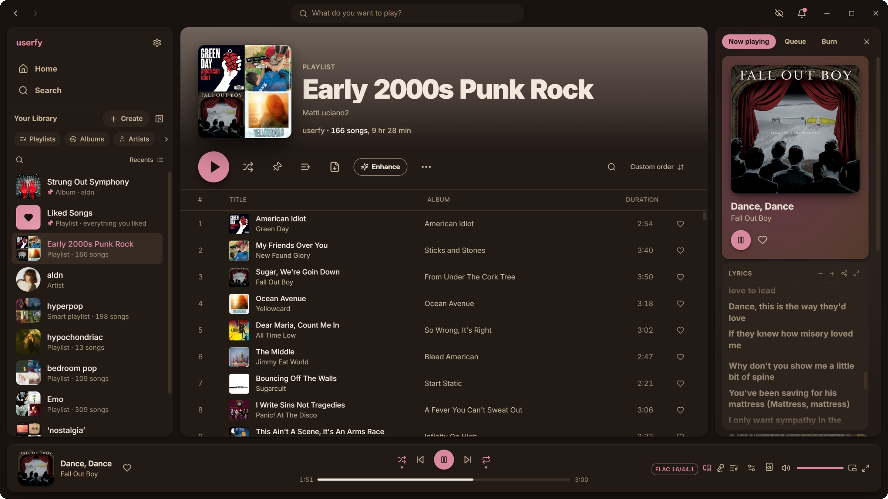 | 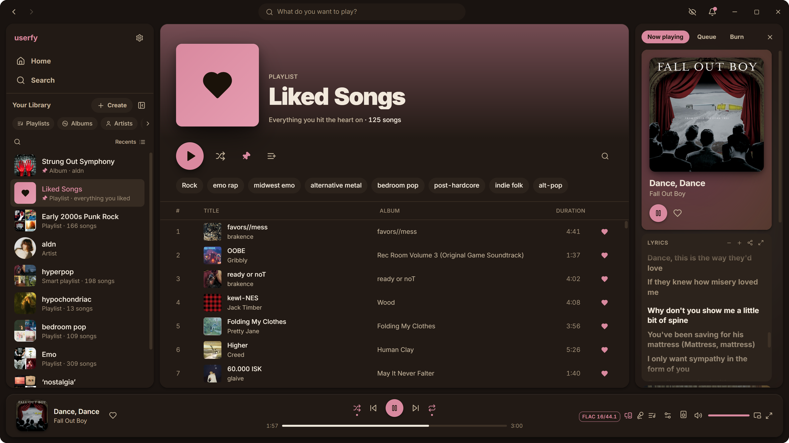 |
| Playlist | Liked Songs with genre filters |
| 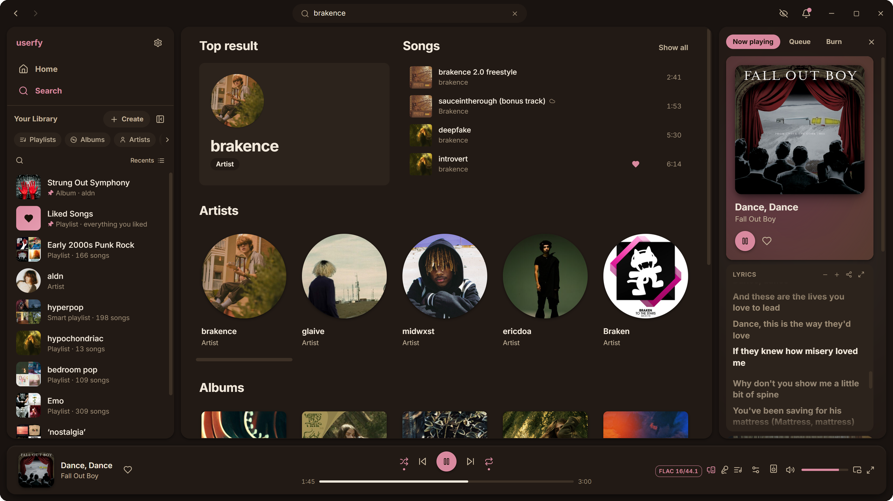 | 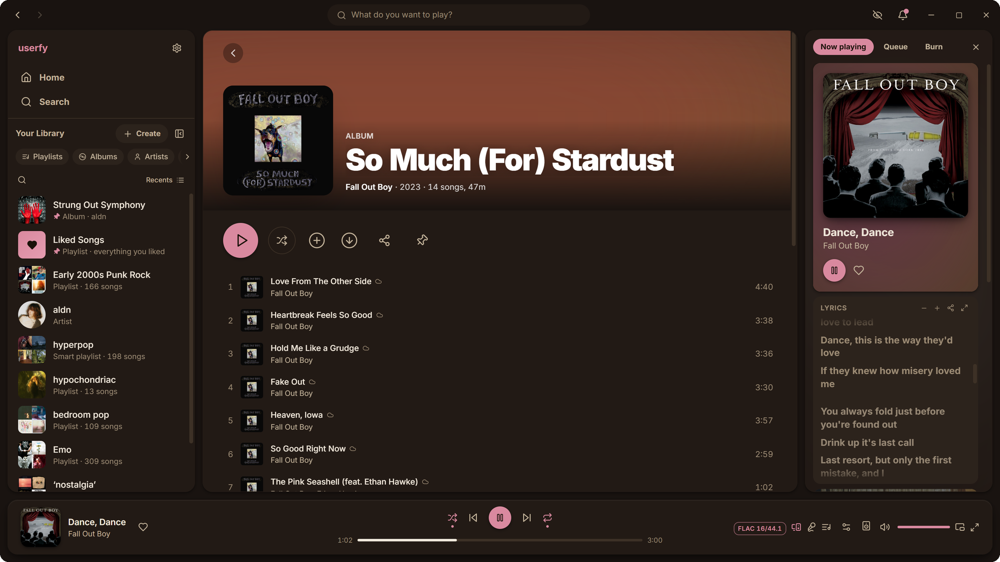 |
| Search across your library and Tidal | A Tidal album, ready to download |
| 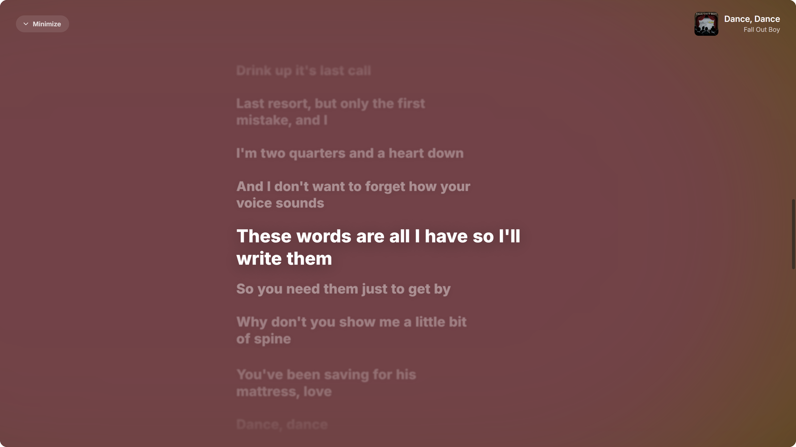 | 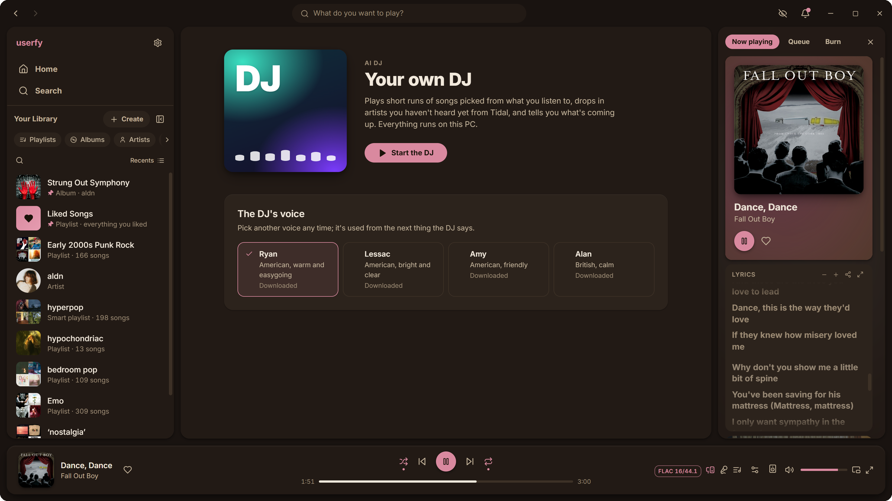 |
| Full-screen synced lyrics | The AI DJ |

Keep it on top of everything else with the mini player:

  

## Download

Grab the latest installer from the [Releases page](../../releases/latest).

| Platform | Formats |
|----------|---------|
| Windows 10 / 11 (64-bit) | `.exe` installer (per user, no admin), `.msi` |

userfy updates itself after that. This repository is the download page and issue tracker; the app itself is closed source.

## Features

- Plays the music already on your drives: MP3, FLAC, WAV, Ogg, Opus and M4A (AAC and ALAC)
- Home shelves, Daily Mixes, a daylist, Discover Weekly, Release Radar and top mixes, all worked out on your PC
- Song and artist radio, autoplay and smart shuffle
- Synced lyrics from `.lrc` files or tags, in the side rail and full screen
- Artist pages, album pages, credits and a now playing rail
- Playlists, folders, smart playlists, drag and drop, undo and Recently deleted
- Wrapped every December 24th, and listening stats all year
- Import Spotify playlists by link, or your whole Spotify data export
- Optional Tidal sign-in to stream, like and download what you don't own as tagged FLAC
- Podcasts, audiobooks and audio CDs (play, rip and burn)
- Gapless playback, crossfade, volume levelling, a 10-band EQ and a sleep timer
- An optional AI DJ and AI playlists that run entirely on your PC
- Mini player, media keys, global hotkeys and a command palette (`Ctrl+K`)
- Auto-updates

## Privacy

Your library, plays, likes and playlists live in a database on your PC and go nowhere else. No ads, no analytics, no account. userfy only goes online for things you turn on: Tidal, a Spotify import, podcasts, Discord presence, the one-time AI model download, and the update check.

## Bugs

Open an [issue](../../issues/new/choose) with what you were doing, what happened, and your version (**Settings → About**). A screenshot helps.

## Credits

Built on [Tauri 2](https://tauri.app), [React](https://react.dev), [SQLite](https://sqlite.org), [Lofty](https://github.com/Serial-ATA/lofty-rs), [Symphonia](https://github.com/pdeljanov/Symphonia), [llama.cpp](https://github.com/ggml-org/llama.cpp), [Qwen3](https://huggingface.co/Qwen), [Piper](https://github.com/rhasspy/piper) and [Inter](https://rsms.me/inter/). Much of the code was written with AI assistance (Anthropic's Claude), directed, reviewed and tested by me. The in-app AI runs entirely on your PC.

userfy ships no music and is not affiliated with Spotify, Tidal or any of the projects above. © 2026 JURMR.
