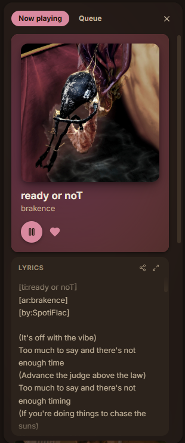
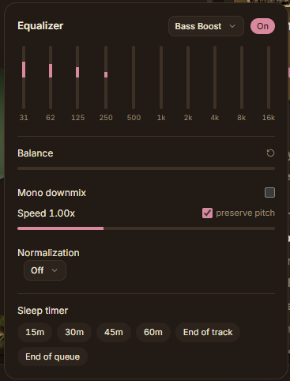
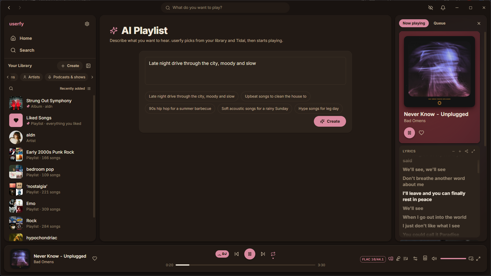
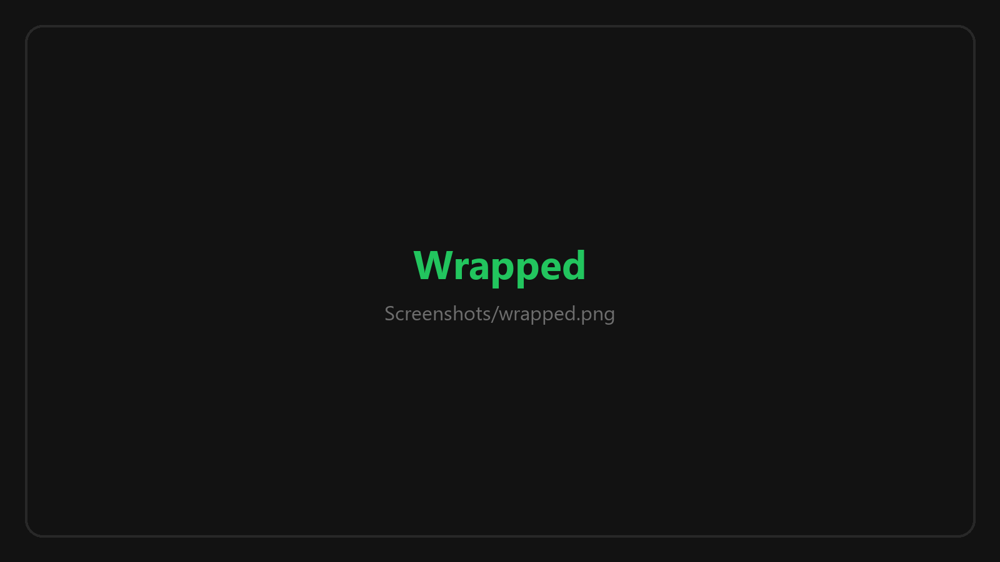
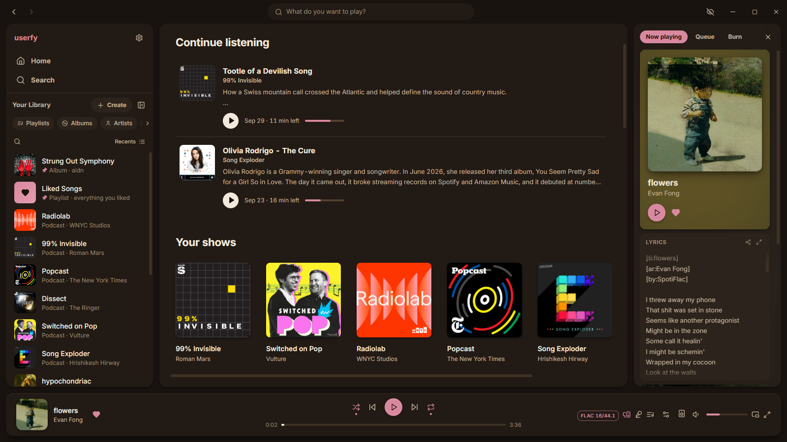
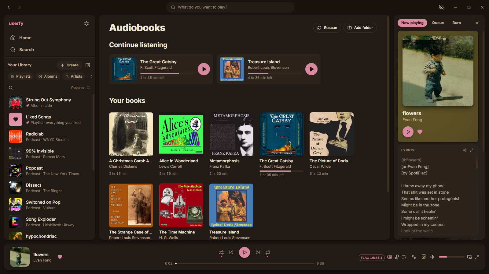
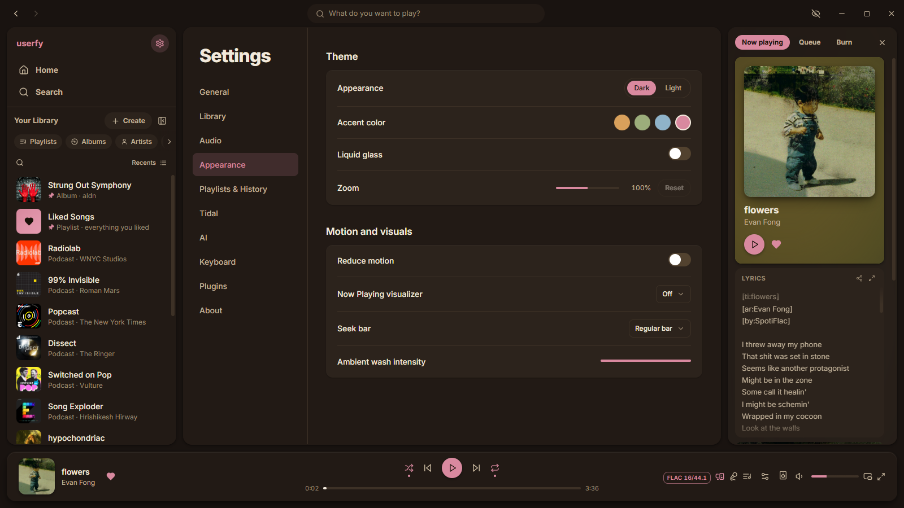

  <a href="#-installing">DOWNLOAD</a>
  &nbsp;&nbsp;•&nbsp;&nbsp;
  <a href="#-screenshots">SCREENSHOTS</a>
  &nbsp;&nbsp;•&nbsp;&nbsp;
  <a href="../../releases">RELEASE NOTES</a>
  &nbsp;&nbsp;•&nbsp;&nbsp;
  <a href="../../issues">REPORT A BUG</a>

  

# userfy

### Spotify, but for the music you actually own.

Point it at the folders already sitting on your drive and it becomes the whole thing: home shelves, daily mixes, synced lyrics, radio, Wrapped, the lot. No ads, no account, no monthly bill, and nothing phoning home.

  
  
  
  
  

  

Windows 10 and 11, 64-bit &nbsp;•&nbsp; about 6 MB &nbsp;•&nbsp; prefer an MSI? <a href="../../releases/latest/download/userfy-installer.msi">grab that instead</a>

  

> [!NOTE]
> This repository is the **download and issue tracker** for userfy. The app itself is closed source, so there is no code here - just the installer, the release notes, and somewhere to shout at me when it breaks.

---

## 🎧 What It Is

Every music app wants to rent you the music. userfy assumes you already own it. It reads your library once, remembers it, and then gives you the app you'd actually want to open every day.

<table>
  <tr>
    <td width="33%" valign="top">
      <h3>🏠 Feels like the real thing</h3>
      Sidebar, Your Library, home shelves, a now playing rail with lyrics under the art, a queue you can drag around. If you know where something is in Spotify, it's in the same place here.
    </td>
    <td width="33%" valign="top">
      <h3>✨ Made For You</h3>
      Daily Mixes, a daylist that changes with the time of day, On Repeat, Repeat Rewind, and top mixes of your favourite artists, genres and decades. Worked out on your PC from what you actually play.
    </td>
    <td width="33%" valign="top">
      <h3>📻 Radio that knows you</h3>
      Start a radio off any song or artist and it lines up what fits: same genre, same era, similar tempo, songs you play back to back. Autoplay keeps it going when the queue runs out.
    </td>
  </tr>
  <tr>
    <td valign="top">
      <h3>🎤 Synced lyrics</h3>
      Karaoke-style lyrics in the rail and full screen, from <code>.lrc</code> files or lyrics already in your tags. Click a line to jump to it.
    </td>
    <td valign="top">
      <h3>🎁 Wrapped, every Dec 24th</h3>
      Your year in music as an animated story that moves in time to your top song. Save the slides, or the whole thing as a video.
    </td>
    <td valign="top">
      <h3>🌊 Stream what you don't own</h3>
      Sign in with your own Tidal account and it slots into search, artist pages and playlists. Like it, save it, or download it as a tagged FLAC.
    </td>
  </tr>
  <tr>
    <td valign="top">
      <h3>🔁 Bring your Spotify playlists</h3>
      Paste a playlist link and get the same playlist, cover and all, filled from your library first and Tidal for the gaps.
    </td>
    <td valign="top">
      <h3>🤖 An AI DJ on your own PC</h3>
      Optional and off until you switch it on. It talks between songs in a real voice, picks what's next, and never sends a thing anywhere.
    </td>
    <td valign="top">
      <h3>🎚️ Sounds as good as your files</h3>
      Gapless, real crossfade, smart transitions, volume levelling, a 10-band EQ, and a badge that tells you exactly what you're hearing.
    </td>
  </tr>
  <tr>
    <td valign="top">
      <h3>🎙️ Podcasts and audiobooks</h3>
      Follow shows, download episodes, and play audiobooks by the chapter, with a sleep timer that stops at the end of one.
    </td>
    <td valign="top">
      <h3>💿 Audio CDs</h3>
      Play a disc, rip it into your library with tags and cover art, or burn a playlist to a blank CD.
    </td>
    <td valign="top">
      <h3>🔄 Keeps itself up to date</h3>
      Checks for a new version on launch, downloads it, checks it against GitHub's checksum, and installs it with one click.
    </td>
  </tr>
</table>

---

## 🖥️ Screenshots

Straight out of the app. Nothing here is a mock-up.

### Your library

<table>
  <tr>
    <td width="50%"></td>
    <td width="50%"></td>
  </tr>
  <tr>
    <td align="center">Playlists, with the header coloured off the cover</td>
    <td align="center">Liked Songs, filtered by genre in one click</td>
  </tr>
  <tr>
    <td></td>
    <td></td>
  </tr>
  <tr>
    <td align="center">Artist pages, your copies and Tidal's side by side</td>
    <td align="center">One search box for everything</td>
  </tr>
</table>

### Now playing

  
   
  Full-screen lyrics. Press <kbd>Y</kbd>.

<table>
  <tr>
    <td align="center" valign="top" width="33%"></td>
    <td align="center" valign="top" width="34%"></td>
    <td align="center" valign="middle" width="33%"></td>
  </tr>
  <tr>
    <td align="center">The rail: art, lyrics, the artist, credits, what's next</td>
    <td align="center">EQ, speed, levelling and a sleep timer</td>
    <td align="center">The mini player, for when you're working</td>
  </tr>
</table>

### Made for you

  
   
  The DJ, your daylist and Daily Mixes, rebuilt every day from what you play.

<table>
  <tr>
    <td width="50%"></td>
    <td width="50%"></td>
  </tr>
  <tr>
    <td align="center">The AI DJ, talking you into the next one</td>
    <td align="center">Describe a vibe, get a playlist</td>
  </tr>
  <tr>
    <td></td>
    <td></td>
  </tr>
  <tr>
    <td align="center">Wrapped, on December 24th</td>
    <td align="center">And the numbers, any day of the year</td>
  </tr>
</table>

### Tidal, podcasts and audiobooks

<table>
  <tr>
    <td width="50%"></td>
    <td width="50%"></td>
  </tr>
  <tr>
    <td align="center">A Tidal album, one click from being yours</td>
    <td align="center">Podcasts, with your place saved in every episode</td>
  </tr>
  <tr>
    <td></td>
    <td></td>
  </tr>
  <tr>
    <td align="center">Audiobooks, right where you left off</td>
    <td align="center">Settings, for when you want it your way</td>
  </tr>
</table>

---

## 📥 Installing

1. Grab **`userfy-installer.exe`** from [the latest release](../../releases/latest).
2. Run it. It installs **per user**, so there's no UAC prompt and no admin rights needed.
3. It lands on the Start menu. Launch it, and it asks for your music folder.

Prefer a machine-wide install in `Program Files`? The same release carries **`userfy-installer.msi`**, which needs admin once and keeps your taskbar pin across updates.

After that, userfy updates itself. Uninstall it whenever you like: your music is never touched, and neither are your playlists, likes and history until you delete them yourself.

| | |
|---|---|
| 📦 **File** | `userfy-installer.exe` (or `userfy-installer.msi`) |
| 💾 **Size** | About 6 MB to download |
| 🏷️ **Version** | 1.0.0 |
| 🪟 **Runs on** | Windows 10 and 11, 64-bit |
| 👤 **Account** | None. There's nothing to sign up for |
| 🎵 **Music included** | None. You bring that |

---

## 🎵 Setting Up Your Music

If you've got a folder of music, you've got a library. Nothing to convert, nothing to import.

1. **Point it at your music** - the first launch asks for a folder, and **Settings → Library** takes as many more as you like, on as many drives as you like.
2. **Let it have a look** - it reads through them once and fills in as it goes, so you can start playing before it's done. After that it just watches for new files.
3. **Play something** - the more you listen, the better Home, the mixes and radio get.

**What it plays:** MP3, FLAC, WAV, Ogg Vorbis, Opus, M4A (AAC and ALAC). WMA files show up in the list but won't play.

**What it picks up on its own, if it's there:**

- Cover art from your tags, or a `cover.jpg` / `folder.jpg` beside the songs
- Artist photos from an `artist.jpg` in the artist's folder, and bios from an `artist.txt` or `artist.nfo`
- Synced lyrics from a `.lrc` next to the song, or lyrics saved in the tags
- A looping video behind the art, from a `Song Name.mp4` beside the song or a `canvas` folder
- BPM and key from your tags, which radio uses to keep the tempo sensible
- Credits (writers, producers, engineers) from your tags

Audiobooks go in their own folder, added under **Audiobooks**. An `.m4b` is a book, and so is a folder of parts. Don't point it at your music folder, it'll refuse.

### Already on Spotify?

Open the **+ Create** menu, choose **From a Spotify link**, and paste a playlist link. You get the same name, cover and order, filled from songs you own. With Tidal signed in, anything you don't own is filled from there, ready to download.

You can also select songs in Spotify, `Ctrl+C`, then `Ctrl+V` on any userfy playlist to drop them straight in.

---

## 🌊 Tidal

Signing in is optional, and everything else works without it. With your own Tidal account signed in (**Settings → Tidal**):

- Tidal shows up in search, on artist pages, and in album and playlist pages of its own
- Songs stream in lossless, or hi-res where Tidal has it
- **Download** a song, a whole album, or a whole playlist as properly tagged FLAC, with the cover and synced lyrics inside. It lands in a folder you choose and joins your library straight away
- Like, save and add Tidal songs to playlists like any other song, and turn on **auto-download** to have anything you add to a playlist saved to your drive
- Follow artists and get a **New releases** feed of what they've put out lately

A Tidal subscription is yours to bring. userfy is not affiliated with Tidal.

---

## 🤖 The AI Bits

All of it is optional, and all of it runs on your PC. Nothing is sent to an AI service, ever.

Switch it on in **Settings → AI**, pick a folder for it, and it downloads a small language model (about 2.5 GB) once. It runs on your graphics card if you have one, and falls back to the processor if you don't. It shuts itself down after five minutes of not being used.

- **AI Playlist** - describe what you want ("rainy drive home", "songs for cleaning the flat") and it builds a named playlist from your library and Tidal. Songs it can't actually find never make it in
- **AI DJ** - a DJ that picks the next few songs from your mixes, your likes and some fresh finds, and talks you into each run in a real voice. Four voices to choose from, each a small extra download

---

## ✨ Everything Else

<b>🎚️ Playback</b>

- Gapless playback and a real crossfade, where the next song overlaps the last
- **Auto transitions** that trim trailing silence and don't stack a fade on a song that already fades out
- Volume levelling, so a quiet 70s record and a loud modern one sit at the same level
- 10-band EQ with presets, playback speed, balance, and mono
- Sleep timer, including "end of this song" and "end of this chapter"
- Pick which speakers or headphones it plays through, right from the player bar
- Shuffle, **smart shuffle** (mixes in songs that fit), repeat, and repeat one
- An audio quality badge on the player bar that tells you the format, bit depth and sample rate
- Media keys, the Windows media overlay, and play/pause/skip buttons on the taskbar thumbnail
- Global hotkeys (`Ctrl+Alt+Space` and friends) that work while another app has focus
- A desktop notification when the song changes and userfy isn't in front

<b>📚 Library and playlists</b>

- Playlists, playlist folders, and **smart playlists** that fill themselves from rules
- Drag songs onto playlists, drag to reorder, and **Undo** when you get it wrong
- Deleted a playlist? It sits in **Recently deleted** for 90 days
- **Enhance** a playlist to see suggestions mixed in, and add the ones you like
- Pin anything to the top of Your Library, filter it, and sort it by recents, name or date added
- **Hide** a song for good, or **snooze** it for 30 days
- Keep a playlist out of your taste profile, so the kids' playlist doesn't ruin your Daily Mixes
- Edit tags, set your own covers, and export playlists as `.m3u`
- **Private session**, for the songs you'd rather not have in your Wrapped

<b>🧭 Getting around</b>

- `Ctrl+K` opens a command palette that goes anywhere and does anything
- `Ctrl+F` searches the page you're on
- `Ctrl+/` shows every keyboard shortcut, and every one of them can be rebound
- `Ctrl+=` and `Ctrl+-` zoom the whole app
- Dark and light themes, four accent colours, and a see-through glass look on Windows 11
- Discord Rich Presence, if you want your friends to see what you're playing (off by default)

---

## 🔒 Privacy

userfy is built to work with the network cable pulled out. Your library, plays, likes and playlists live in a database on your PC and go nowhere else. There are no ads, no analytics, and no account.

It only goes online for something you asked for:

| When | What it talks to |
|---|---|
| You sign in to Tidal, then stream, search or download | Tidal |
| You import a Spotify playlist | Spotify's public playlist page |
| You search for or follow a podcast | Apple's podcast directory, then the show's own feed |
| You press **Find photo online** on an artist | Deezer or TheAudioDB, for that one picture |
| You turn on Discord presence | Discord on your PC, plus Deezer for the cover image |
| You turn on the AI features | Hugging Face and GitHub, once, to download the model and voices |
| It checks for updates (on launch, or when you press **Check for updates**) | This page |

---

## 🧰 System Requirements

<table>
<tr><th></th><th>Minimum</th><th>Recommended</th></tr>
<tr><td><b>OS</b></td><td>Windows 10, 64-bit</td><td>Windows 11, 64-bit</td></tr>
<tr><td><b>Processor</b></td><td>Any dual core from the last ten years</td><td>Any quad core</td></tr>
<tr><td><b>Memory</b></td><td>4 GB RAM</td><td>8 GB RAM, 16 GB for the AI features</td></tr>
<tr><td><b>Graphics</b></td><td>Anything</td><td>A graphics card with 4 GB of memory, for the AI features</td></tr>
<tr><td><b>Storage</b></td><td>50 MB, plus room for your music</td><td>3 GB more, if you use the AI features</td></tr>
<tr><td><b>Other</b></td><td colspan="2">Microsoft Edge WebView2, already on every Windows 11 PC. The installer fetches it on Windows 10 if it's missing</td></tr>
</table>

---

## 🙏 Credits and Third Party Work

| | |
|---|---|
| **[Tauri 2](https://tauri.app)** | The app shell, MIT / Apache 2.0 |
| **[React](https://react.dev)**, **[Tailwind CSS](https://tailwindcss.com)**, **[Zustand](https://github.com/pmndrs/zustand)** | The interface, MIT |
| **[SQLite](https://sqlite.org)** via **[rusqlite](https://github.com/rusqlite/rusqlite)** | The library database, public domain / MIT |
| **[Lofty](https://github.com/Serial-ATA/lofty-rs)** | Reading and writing tags, MIT / Apache 2.0 |
| **[Symphonia](https://github.com/pdeljanov/Symphonia)** | Decoding audio for analysis, MPL 2.0 |
| **[ebur128](https://github.com/sdroege/ebur128)** | Loudness measurement for volume levelling, MIT |
| **[souvlaki](https://github.com/Sinono3/souvlaki)** | Windows media controls, MIT |
| **[llama.cpp](https://github.com/ggml-org/llama.cpp)** | Running the AI model locally, MIT |
| **[Qwen3](https://huggingface.co/Qwen)** by Alibaba Cloud | The AI model, Apache 2.0 |
| **[Piper](https://github.com/rhasspy/piper)** | The AI DJ's voice, MIT, with voices under their own licences |
| **[Mediabunny](https://github.com/Vanilagy/mediabunny)** | Saving Wrapped as a video, MPL 2.0 |
| **[Lucide](https://lucide.dev)** | Icons, ISC |
| **[Inter](https://rsms.me/inter/)** by Rasmus Andersson | The typeface, OFL |

### AI disclosure

Up front, since people ask.

- **A lot of the code was written with AI assistance** (Anthropic's Claude), directed, reviewed, tested and debugged by me. The design decisions and every bug in it are mine.
- **The AI features in the app run entirely on your PC**, on an open model you download yourself. There is no cloud AI service behind any of it.
- **userfy ships no music.** Everything it plays is yours, or streamed from your own Tidal account.

### Not affiliated

userfy is not affiliated with, endorsed by or connected to Spotify, Tidal, Apple, Deezer, Discord or any of the projects above. All trade marks belong to their owners.

---

## 🐛 Something Broken?

Open an [issue](../../issues/new/choose) and say what you were doing, what happened, and which version you're on (**Settings → About**). A screenshot helps more than you'd think.

---

  

**Your music. Your app.**

Made by **JURMR**.

© 2026 JURMR. userfy is not affiliated with Spotify or Tidal.

